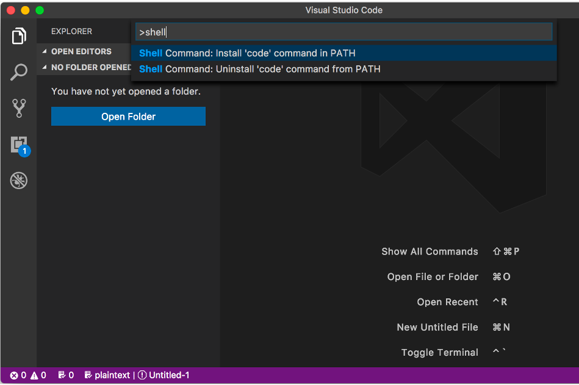

# Git, GitHubとは？ - 準備手順
<!-- classes: main, left -->


<!-- classes: main, title -->

<br />

by [Kintone Developer Program](https://developer.kintone.io/hc/en-us/)

<br />

<!-- block-start: grid, sns-box -->
<!-- account: github, ahandsel -->
<!-- block-end -->

---

## Overview
<!-- classes: main, left -->

<!-- sectionTitle: Overview -->

### コンテンツの目的
<!-- classes: main, left -->

SC本部メンバーが。。。
  1. Git と GitHub について理解できた
  2. GitHub でコードを管理できるようになった

### 概要
<!-- classes: main, left -->

<!-- block-start: grid -->

<!-- block-start: column -->

#### Gitの基本
<!-- classes: main, left -->

[](https://git-scm.com/)

<!-- block-end -->

<!-- block-start: column -->

#### GitHubの基本
<!-- classes: main, left -->

[](https://github.com/)

<!-- block-end -->

<!-- block-start: column -->

#### ハンズオン
<!-- classes: main, left -->

  - Gitをインストールする
  - GitHubアカウントを作成する
  - リポジトリを作成する

<!-- block-end -->
<!-- block-end -->

---

## GitHubアカウント
<!-- classes: main, left -->

<!-- sectionTitle: GitHub Account -->


### GitHubアカウントを作成する
<!-- classes: main, left -->

[github.com/join](https://github.com/join)  
[](https://github.com/join)

---

### 2要素認証を設定する
<!-- classes: main, left -->

  1. GitHub設定画面に移動します: [github.com/settings/security](https://github.com/settings/security)
     - `Two-factor authentication` (2要素認証) の下で`Enable two-factor authentication` (2要素認証の有効化) をクリックしてください。
     - `Two-factor authentication` のページで、`Set up using an app` をクリックします。
  2. Authenticator Appを作成する
     - 提案: [Microsoft](https://www.microsoft.com/en-us/account/authenticator), [Authy](https://authy.com/guides/github/), [Enpass](https://www.enpass.io/)

#### Resources
<!-- classes: main, left -->

  - GitHub help doc: [2 要素認証を設定する](https://help.github.com/ja/github/authenticating-to-github/configuring-two-factor-authentication)
  - YouTube: [How to setup 2FA with GitHub](https://youtu.be/5DKqXeorDHY)

---

### コマンドラインの個人アクセストークン
<!-- classes: main, left -->

パーソナルアクセストークンを生成する
  - Settings > Developer settings > Personal access tokens
  - [github.com/settings/tokens/new](https://github.com/settings/tokens/new)

<br />

このtokenはターミナル経由でGitHubアカウントにアクセスする時に使用します
  - Passwordの代わりにトークンを使用します
  - ユースケースごとにtokenを生成します

<br />

GitHubの検証のためのtokenを作って保存してください。

<br />


GitHub Docs: [個人アクセストークンを使用する](https://docs.github.com/ja/github/authenticating-to-github/creating-a-personal-access-token)

---

## Visual Studio Code + Command Line
<!-- classes: main, left -->

<!-- sectionTitle: VS Code & CLI -->

コマンドラインからVSコードを実行する

<br />

  - VS Codeを開く
  - Command Paletteを開く
  - `Command` \+ `Shift` \+ `P`
  - Shellと入力して& Shell Command: `Install code in PATH`を選択する
  - Terminalを再起動する
  - `code .` と入力することでVSCodeが開きます

<br />

Visual Studio Code Download Link: [code.visualstudio.com](https://code.visualstudio.com/)

<br />



---

## MacOS - Gitのインストール
<!-- classes: main, left -->

<!-- sectionTitle: MacOS & Git -->

<!-- classes: main, left -->
Step 0: Homebrewの確認
<!-- classes: main, left -->

  - インストールされていなければ、最初にHomebrewをインストールします。
  - [brew.sh](https://brew.sh/)
- Step 1: 新しいパッケージをインストールする前にはアップデートとアップグレードしましょう.  
`brew update && brew upgrade`  
<br />

- Step 2: Homebrew で git をインストール  
`brew install git`  
<br />

- Step 3: インストールの確認
  - `git --version`

- Gitのバージョンが表示されれば成功です！
  - `git version 2.31.1`

### Debugging
<!-- classes: main, left -->

- もし次の結果が返ってきた場合
  - `git version 1.7.10.2 (Apple Git-33)`
- このコマンドを実行してください！
  - `$ brew link --force git`
- またはこちらを実行してください！
  - `export PATH=/usr/local/bin:$PATH`

詳細: [Git - Gitのインストール](https://git-scm.com/book/ja/v2/%E4%BD%BF%E3%81%84%E5%A7%8B%E3%82%81%E3%82%8B-Git%E3%81%AE%E3%82%A4%E3%83%B3%E3%82%B9%E3%83%88%E3%83%BC%E3%83%AB)

---

## Windows 10 - Gitのインストール
<!-- classes: main, left -->


＃3 Gitを構成する

＃1 Linux用のWindowsサブシステム (WSL) をインストールする

＃2 WSLを構成する

Ubuntu 18\.04 LTS

[github\.com/hangxingliu/wslgit](https://github.com/hangxingliu/wslgit)

git clone git@github\.com:user / a\.git

## WSLに必要な環境
<!-- classes: main, left -->


<!-- block-start: grid -->
<!-- block-start: column -->

1. Start button
2. Settings
3. Update & Security
4. Windows Update

<!-- block-end -->
<!-- block-start: column -->

  - 必ずWindows OSを更新してください
  - Windows 10 Version1709 (OS build16299) 以降である必要があります。

<!-- block-end -->
<!-- block-start: column -->


<!-- block-end -->
<!-- block-end -->

## インストール Windows Subsystem for Linux (WSL)
<!-- classes: main, left -->


dism\.exe /online /enable\-feature / featurename:Microsoft\-Windows\-Subsystem\-Linux /all / norestart

  - 「Linux用Windowsサブシステム」オプション機能を有効にする
  - 管理者としてPowerShellを開き、コマンドを実行します
  - Open PowerShell as Administrator
  - プロンプトが表示されたらコンピュータを再起動します。
  - [https://docs\.microsoft\.com/ja\-jp/windows/wsl/install\-win10](https://docs.microsoft.com/ja-jp/windows/wsl/install-win10)

dism\.exe /online /enable\-feature / featurename:Microsoft\-Windows\-Subsystem\-Linux /all / norestart

両方のコードブロックは同じです。小さなものは、コピー＆ペーストのためです。


  - 選択したLinuxディストリビューションをインストールする
  - Microsoft Storeからダウンロードしてインストールします (以下を参照)
  - [Ubuntu 18\.04 LTS](https://www.microsoft.com/store/apps/9N9TNGVNDL3Q)
  - [microsoft\.com/store/apps/9N9TNGVNDL3Q](https://www.microsoft.com/store/apps/9N9TNGVNDL3Q)

[https://docs\.microsoft\.com/ja\-jp/windows/wsl/install\-win10](https://docs.microsoft.com/ja-jp/windows/wsl/install-win10)

## WSLの初期化
<!-- classes: main, left -->


```terminal
, this may take a few minutes...
Please create a default UNIX user account. The username does not need to match your Windows username.
For more information visit: https://aka.ms/wslusers

Enter new UNIX username: panda
Enter new UNIX password:
Retype new UNIX password:

passwd: password updated successfully
Installation successful!
To run a command as administrator (user "root"), use "sudo <command>".
See "man sudo_root" for details.

```

  - ディストリビューションを起動します (Ubuntu 18\.04)
  - Microsoft Storeアプリの launch ボタンをクリックします
  - 新しいLinuxユーザーアカウントの設定
  - このユーザーアカウントはWindowsユーザー名に影響しません
  - sudoコマンドを実行するときにこの設定されたパスワードが必要です

## Gitをインストールする
<!-- classes: main, left -->


  - ディストリビューションのパッケージを更新してアップグレードする
  - 「続行しますか？\[Y / n\]」と尋ねられたら、Yを入力します。
  - gitをインストールする

`sudo apt update && sudo apt upgrade`

`sudo apt install git`

## WSLを構成する
<!-- classes: main, left -->


  - [wslgit](https://github.com/hangxingliu/wslgit)リポジトリをダウンロードする
  - [wslgit](https://github.com/hangxingliu/wslgit)はgitのすべてのリクエストをWSLに転送するツール
  - wslgitフォルダー内に移動
  - wslgit\.shファイルを/usr/binのWSL実行可能ファイルの場所に移動します
  - ホームフォルダーに戻る

$ git clone https:// github\.com / hangxingliu / wslgit

$ cd wslgit /

$ sudo mv wslgit\.sh / usr /bin/ wslgit\.sh

$ cd


## WSL - VS Code
<!-- classes: main, left -->


  - Remote \-WSL VS Code Extensionをダウンロード
    - [Remote - WSL - Visual Studio Marketplace](https://marketplace.visualstudio.com/items?itemName=ms-vscode-remote.remote-wsl)
  - VSコード設定に移動して、`git.path`オブジェクトを変更します。
  - _WindowsUSER_ と _UbuntuUSER_ を独自のものに置き換えます。

```powershell
{
    "git.path": "C:\Users\WindowsUSER\AppData\Local\Packages\CanonicalGroupLimited.Ubuntu18.04onWindows_79rhkp1fndgsc\LocalState\rootfs\home\UbuntuUSER\wslgit\git.bat"
}
```

## Ubuntuの日本語版
<!-- classes: main, left -->


sudo apt \-y install language\-pack\-ja

sudo update\-locale LANG=ja\_JP\.UTF8

sudo apt \-y install manpages \-ja manpages \-ja\-dev

  - 日本語パックをインストールする
  - 現地の言語を日本語に設定する
  - Ubuntuを再起動します
  - 日本語のマニュアルをインストールする

## Git + GitHub設定
<!-- classes: main, left -->


[GitHub.com/settings](https://github.com/settings/)
  - [SSH and GPG Keys](https://github.com/settings/keys)
    - [New SSH key ボタン](https://github.com/settings/ssh/new)


  - タイトルにWindows WSLと入力します.
  - 公開キー (public key) を貼り付けます
    - > Add SSH keyボタン


  - $ ssh \-keygen
  - Generating public/private rsa key pair\.
  - Enter file in which to save the key \(/home/user/\. ssh / id\_rsa \):
  - Created directory '/home/user/\. ssh '\.
  - Enter passphrase \(empty for no passphrase\):
  - Enter same passphrase again:
  - Your identification has been saved in /home/user/\. ssh / id\_rsa \.
  - Your public key has been saved in /home/user/\. ssh / id\_rsa\.pub \.
  - …

SSHキーを生成する

GitHubとのリンクが必要です

質問は空白のままにして、そのまま入力してください

キーをクリップボードにコピーします

これは、GitHub\.comの設定ページに貼り付ける必要があります。

cat ~/\. ssh / id\_rsa\.pub | clip\.exe

GitHub\.com/settings

> SSH and GPG Keys

> New SSH key ボタン

タイトルにWindows WSLと入力します\.

公開キー\(public key\)を貼り付けます

> Add SSH key ボタン

## 設定を確認
<!-- classes: main, left -->

次のコマンドで設定を確認します

```terminal
$ ssh -T git@github.com
The authenticity of host 'github.com (13.114.40.48)' can't be established.
RSA key fingerprint is SHA256:xxx.
Are you sure you want to continue connecting (yes/no)? yes
Warning: Permanently added 'github.com,13.114.40.48' (RSA) to the list of known hosts.
Hi ahandsel! You've successfully authenticated, but GitHub does not provide shell access.
```

## VS Code + Explorer
<!-- classes: main, left -->


現在のLinuxフォルダーからエクスプローラーを開くには、次のように入力します。
  - `explorer.exe .`

現在のLinuxフォルダーからVS Codeを開くには、次のように入力します。
  - エラーがある場合は、UbuntuとVSコードを再起動してください
  - `code .`

詳細: [Windows 10 に WSL をインストールする | Microsoft Docs](https://docs.microsoft.com/ja-jp/windows/wsl/install-win10)

## Windows + WLS と GitHub
<!-- classes: main, left -->

HTTPSを使用する代わりに -->  SSHを使用
  - `git clone https://github.com/.../a.git`
  - `git clone git@github.com:.../a.git`

## Gitの設定をする
<!-- classes: main, left -->

  - **git config** コマンドを使用して、Gitのユーザー名とメールを設定します。
  - _GitHub\_UserName_ と _example@email\.com_ 以下を自分のものに置き換えてください
  - Mac : Terminalを使用
  - Windows : Ubuntuを使用

```terminal
$ git config --global user.name "GitHub_UserName"
$ git config --global user.email "example@email.com"
$ git config --global color.ui auto
$ git config --global --list
```

詳細: [Git - 最初のGitの構成](https://git-scm.com/book/ja/v2/%E4%BD%BF%E3%81%84%E5%A7%8B%E3%82%81%E3%82%8B-%E6%9C%80%E5%88%9D%E3%81%AEGit%E3%81%AE%E6%A7%8B%E6%88%90)
